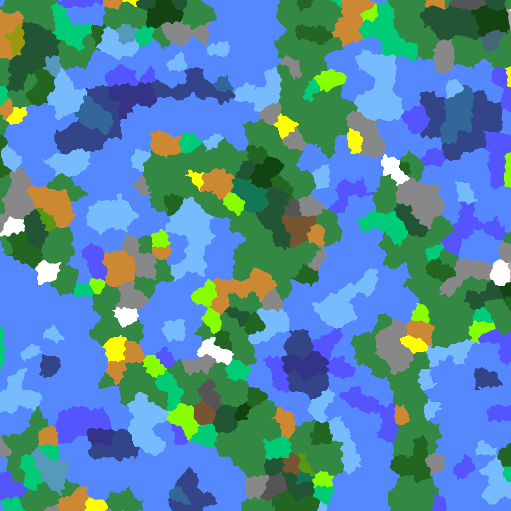

# biome-gen-proto

Experiments with placing discrete biomes in a Minecraft-like world.
The main requirements are:
* Consistent seed-based random sampling anywhere in the world
* Don't place incompatible biomes next to each other (i.e. desert next to ice)
* Avoid artifacts

To meet the second requirement, biomes will be based on the values sampled from
temperature, wetness, and "ocean" noise maps.

To assist in meeting the third requirement, the sampling location for each
pixel will be randomly offset before sampling the biome map.

## Strategy 1: No-op

Just sample the noise maps at each location and directly determine the biome.

Pros:
* Simple
* No grid-like artifacts, (assuming a good noise function)

Cons:
* Very smooth lines separating biomes, even with the random offsetting of each pixel
* Frequently generates very small biomes, and those would look like glitches in-game

## Strategy 2: Grid-based Voronoi Cells

To sample a location, identify the 4 nearest integer lattice points. Generate
an offset for each of them to obtain their cell centers. Pick the closest one,
and sample the noise maps at its cell center to determine the biome.

Pros:
* All biomes are reasonably sized
* We can get a center point for our biome if we want

Cons:
* It's pretty easy to see the underlying grid structure
* Little to no variation in biome size
* Sometimes the nearest point wouldn't actually be associated with the four
  nearest integer lattice points, which would create more grid artifacts.

If a weight is associated with each voronoi cell, then the variation in biome
size problem can be solved. However, this would execerbate the "true nearest
point not tested" problem.

## Strategy 3: Poisson-Disc Tile Voronoi Cells

We first generate a Poisson disc distribution for the entire plane by generating
a tileable distribution and tiling it across the plane. These are our biome
centers. To sample a location, find the nearest point and sample the noise maps
there to determine the biome.

Pros:
* No grid-like artifacts with biome borders
* All biomes are reasonably sized
* We can get a center point for our biome if we want

Cons:
* Biome shapes repeat in a grid-like fashion
* Little to no variation in biome size

If a weight is associated with each voronoi cell, then the variation in biome
size problem can be solved, and the biome shapes repeating problem can be
mitigated.

There are also techniques for generating Poisson-disc tilesets and choosing
tiles from them that would greatly help with the repeating grid problem.
